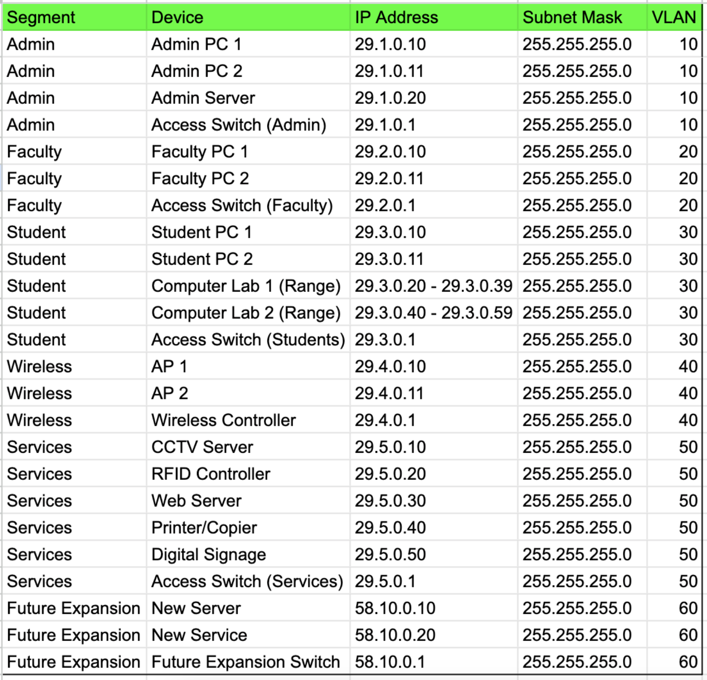

# Network Design
This section gives the detailed network design.

[Network Design Diagrams and Justifications](#network-design-diagrams-and-justifications) | [WiFi Design](#wifi-design) | [Address Allocations](#address-allocations) | [Recommended Hardware](#recommended-hardware) | [Plan](./plan.md) | [Cloud Services](./cloud.md) | [Security](./security.md) | [Ethics](./ethics.md) | [Reflection](./reflection.md) | [Return to index](./README.md)

## Network Design Diagrams and Justifications

The following is a screenshot of the Network Diagram:  

The following is a draw.io File of Network Diagram:  
[Network diagram Drawio file](./images/Network%20diagram.drawio)

**Justifications of Network diagrams:**  

In order to satisfy the requirements of the gym franchisor's new locations, which include the corporate headquarters, premium gym outlet, and retail store, my network design integrates a number of components. Here is a rationale for every element:  

-we use AT&T's ISP(Internet Service Provider) first. It gives the gym franchisor's location external internet connectivity, enabling it to host web services, access online resources, and communicate with outside parties like partners, suppliers, and consumers.  

-Following that, we took The main point of entry between the internal network and the internet is the router. Network address translation (NAT), firewalling, and traffic routing are all handled by it to guarantee effective and safe connection between internal devices and external networks. I took juniper network's router.  

-Cisco network firewall is what we took.An additional layer of security is added by putting a firewall in between the internal network and the router. Incoming and outgoing traffic is inspected and filtered by it, upholding security regulations and guarding against viruses, illegal access, and other online dangers.  

-The essential apps and services for the gym franchisor's operations are hosted by servers and we use Oracle company's server. Business-critical data is stored and managed by the database server, while the web server powers the company's website and online services. Processes connected to inventory, like keeping track of orders and stock levels, are managed by the inventory server.  

- The central networking device is the Layer 3 switch, which connects various network segments and allows inter-VLAN routing. It preserves network segmentation and security while guaranteeing effective data flow and communication throughout the building. We use Cisco switches. 

**Network Diagram: Administrator Segment:-**  

- An Administrator Segment is an important part of campus network as it contains the equipment’s required for all kinds of administrative functions such as financial, enrollment and course related functions. Its design is based on the need to ensure that certain data which should not be revealed to other user groups is protected while at the same time promoting smooth running of other organizational activities which may not require high levels of privacy.  

**Network Diagram: Faculty Segment:-**  

- The Faculty Segment provides connectivity of the teaching staff so that they can easily access course management systems, texts, and other resources. Its main goal is to grant access to the said network while at the same time keeping it isolated from other networks for security and performance purposes.  

**Network Diagram: Student Segment:-**  

- The Student Segment is the largest segment as well as the most evolving segment in the campus network for students’ connectivity.   This includes student owned devices, School owned computers and mobile labs and wireless connectivity. This segment is design of allow many users and traffic and protect from unwanted access by others. 

**Network Diagram: Wireless Segment:-**  
- The Wireless Segment ensures that the staff and students gain INTERNET and Network resources access from various areas of the covered campus.

**Network Diagram: Services Segment:-**  
- The Services Segment diagram shows the network that is exclusively committed to the different services within the campus as well as the devices. This comprises the CCTV server used for security purposes, the RFID controller for door opening, the web server hosting the organization’s website and networked printers/ copiers for shared printing purposes and screen displays for dissemination of information. 

**Network Diagram: Future Expansion:-**  
- The Future Expansion segment in the network diagram captures provision for expansion in future to meet ever expanding requirement of the organization and the new technologies that may be required in future. It adds a special ‘Future Expansion Switch’ key and assigns VLAN 60 to future network segments, something which shows careful planning of the network.

## WiFi Design

- The WiFi is one of the important facility of the training organization as it offers wireless connection to students and staff in the campus. To this end, it is expected to accommodate many users while guaranteeing adequate access and data throughput while also providing a secure and VLAN segmented network along with superior encryption. 
 
- Network Components Selection 
 
- Wireless Controller: It will be easier and less involving to setup and manage because a centralized controller (e. g. , Cisco Meraki, Aruba, Ubiquiti) will handle and coordinate all the access points. 
- Access Points (APs): It focuses on the enterprise-grade APs that are capable of supporting 802. 11ac Wave 2 or Wi-Fi 6 (802. 11ax) is going to guarantee the high performance and capacity. For better efficiency especially in high density, look at models that have MU-MIMO and beamforming. 
- (Implied) Core, Distribution, and Firewall/Router: These are some of the components of the complete network; they are responsible for Internet connection and for accessing system and network resources securely. 
 
- WiFi Network Design Considerations 
 
- Multiple SSIDs: Utilize different SSIDs for staff and students; This means creating two Zones such as StaffWiFi and StudentWiFi so as to have different policies and security settings. 
- Strong Encryption: Both the SSIDs should use WPA3, the latest and the strongest encryption protocol at the moment. 
- VLAN Assignment: It will be useful to assign Staff WiFi to VLAN 40 and Student WiFi to VLAN 30 to have the network split by the VLANS and to isolate the traffic. 
- Bandwidth Management and QoS: Ensure QoS is enabled on wireless controller and access switch to be used to prioritize some applications such as learning management systems, video conferencing etc and also to control bandwidth usage particularly that which is used by students. 
- Access Control: Use reliable types of authentication such as RADIUS or WPA2-Enterprise with 802. 1X for both SSIDs. This is important so as to make sure that only people who are allowed to connect to the network do so. 
- Rogue AP Detection: To enhance wireless security, configure to turn the rogue AP detection on the wireless controller so that it can easily detect any unauthorized access point that may have been installed with an aim to threaten the security of the network. 
- Guest Network: Offer a guest network which is less privileged as the actual wireless networks that the guests should not interfere with regular networks. 
 
- The use of automated system for IP Address assignment using student’s ID number 
 
-  VLAN 40 (Wireless - Staff):VLAN 40 (Wireless - Staff): 
-  Network Address: 29. 4. 0. 0/24 
-  Usable IP Range: 29. 4. 0. 1 - 29. 4. 0. 254 
-  VLAN 30 (Wireless - Students):VLAN 30 (Wireless - Students): 
-  Recycles the IP range from the Student Segment (29. 3. 0. 0/24) so that no addressing conflicts occur and to facilitate administering. 
 
- Technical Explanations 
 
- Centralized Management: What really stands out in this model or design is the fact that a wireless controller helps minimize AP admin through management, configuration and even updates on the firmware. 
- VLANs and SSIDs: Using different SSIDs for different VLANs provides a greater level of protection and also provides better control over only the network’s traffic. 
- WPA3 Encryption: Offers the highest security standard of WI-FI since it keeps off other people from accessing your network and intercepting your data. 
- RADIUS/802. 1X Authentication: It helps in the central control of authorized users allowing only the right user to access the network. 
- QoS: Takes vital applications and controls the bandwidth in order to give priority to the important tasks.

## Address Allocations.

The following is a screenshot of Address allocation Table:  

## Recommended Hardware

The following is a Link of hardware devices:  
[Router Link](https://www.networkscreen.com.au/MX10003.asp?)  
[Firewall Link](https://www.cisco.com/c/en/us/obsolete/security/cisco-asa-5585-x-adaptive-security-appliance.html)  
[Switch Link](https://www.equipnetworks.com.au/product-category/new-cisco-equipment/cisco-switches/cisco-9200-series-switches/page/2/?)  
[WiFi access point Link](https://www.ubnt.com.au/unifi-access-point-ac-pro)  
[Server Link](https://www.ubnt.com.au/unifi-access-point-ac-prohttps://www.oracle.com/au/engineered-systems/exadata/database-machine/) 
[CCTV Link](https://www.hikvision.com/au-en/products/smart-hybrid-light-cameras-with-colorvu/?)  

The following is a screenshots of Hardwares and it's specifications:  

